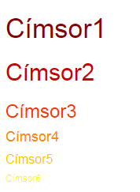
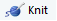

```{r setup, include=FALSE}
knitr::opts_chunk$set(echo = TRUE)
```

#&#46; Röviden a Markdownról

Ha szövegszerkesztésre gondolunk, akkor az egyik végletet az olyan WYSIWYG ("**w**hat **y**ou **s**ee **i**s **w**hat **y**ou **g**et") szövegszerkesztõk jelentik, mint a Microsoft Word. A szerkesztõ felületre bevitt szöveg ugyanúgy néz ki kész formájában, mentés után, vagy nyomtatásban, mint miközben szerkesztjük. A másik végponton olyan eszközök, nyelvek helyezkednek el, mint például a HTML, ahol a szerkesztõbe gépelt szöveg jelentõsen eltér a végeredményként kapott outputtól, a formázást valamilyen syntaxszal határozzuk meg.

Összehasonlításképpen egymás mellé tehetjük egy Word típusú szerkesztõfelület képét, és az azonos outputot eredményezõ HTML kódot.

-----------------------------------------------------------------------------------------------------------------


-----------------------------------------------------------------------------------------------------------------

A screenshot egy online [HTML szerkesztõ oldalról](https://html-online.com/editor/) származik. A bal oldalon egy Word típusú szerkesztõ felület található, a jobb oldalon pedig egy HTML szerkesztõ felület kap helyet. Bármelyik oldal szerkeszthetõ, ha az egyik oldal változik, akkor a változtatásnak megfelelõen módosul a másik oldal is. Így interaktívan kipróbálható, hogy az egyes formázásoknak mi a HTML megfelelõje, vagy hogy egy HTML kód milyen outputot eredményez. A WYSIWYG megközelítési mód elõnye, hogy egyszerû, és könnyen elsajátítható, a syntax alkalmazása viszont megkönnyíti a stílus konzisztenciájának fenntartását, a stílus változása esetén egyszerûbb a módosítás, és az ilyen módon létrehozott dokumentumok könnyebben értelmezhetõek más programok számára.

A Markdown nyelv a két végpont között helyezkedik el, minimális syntax alkalmazásával hozunk vele létre formázott szöveget. Az elõzõ példa Markdown syntaxa:

```
# My Level1 heading

## First chapter

It was a rainy day.

## Second chapter

My To Do list for today:

* Buy food
* Draw something nice
* Write emails

Long term goals:

Date | Task
--- | ---
2018.01.01 | Make New Year's resolutions
2018.01.02 - 2018.12.31 | Keep them

```

Az R Markdown a Markdown nyelvre épül, a célja, hogy egyszerûen és gyorsan létre lehessen hozni olyan dokumentumokat, amik nem csak az eredményeket, hanem az azt létrehozó kódot is tartalmazzák. A kutatások eredményei így könnyebben megoszthatóvá, és reprodukálhatóvá válnak. Az R Markdown dokumentumok megírásuk után konvertálhatóak más formátumú fájlokká. A kuzuson mi .html outputtá fogjuk alakítani a megosztáshoz a dokumentumainkat.

#&#46; R Markdown syntax

A 6 címsor stílust különböztetünk meg, amiket a címsor szintjének megfelelõ számú `#` jelöl.

```
# Címsor 1
## Címsor 2
### Címsor 3
#### Címsor 4
##### Címsor 5
###### Címsor 6 

```
**Italic formázás:** egy \* vagy egy _, például `*szöveg*` -> *szöveg*

**Bold formázás:** két \* vagy két _, például `**szöveg**` -> **szöveg**

**Felsõ index:** ^, például `2^3^ = 8` -> 2^3^ = 8

**Alsó index:** ~, például `Lábjegyzet~1~` -> Lábjegyzet~1~

Ha listát szeretnénk létrehozni, akkor a lista alatt és felett ki kell hagyni egy sort. A rendezetlen lista elemeit *, a rendezett lista elemeit a listaelem sorszáma elõzi meg. Ha a lista többszintû, akkor az alsóbb szintek mindig két szóközzel, vagy két tabbal beljebb kezdõdnek.

```
**Rendezetlen lista**

* lista elem
* még egy lista elem
    * ezen belül még egy
    * és még egy
* ez alatt rendezett elemek vannak
    1. elsõ
    2. második
    3. harmadik

```

**Rendezetlen lista**

* lista elem
* még egy lista elem
    * ezen belül még egy
    * és még egy
* ez alatt rendezett elemek vannak
    1. elsõ
    2. második
    3. harmadik

```
**Rendezett lista**

1. elem1
2. elem2
    1. elem
    2. elem2
    3. elem3
3. elem3
    * nem rendezett
    * ez sem rendezett

```

**Rendezett lista**

1. elem1
2. elem2
    1. elem
    2. elem2
    3. elem3
3. elem3
    * nem rendezett
    * ez sem rendezett

**Link:** `[Link szövege](hiperlink)`, például `[RStudio honlap](www.rstudio.com)` -> [RStudio honlap](www.rstudio.com)

**Kép beszúrása:** ``, például `` -> 

----------------------------------------------------------------------------------------------------------------


----------------------------------------------------------------------------------------------------------------

További formázási lehetõségek a [Reference Guide](https://www.rstudio.com/wp-content/uploads/2015/03/rmarkdown-reference.pdf)-ban találhatóak, vagy az R Markdownnal kapcsolatos legfontosabb ismereteket összefoglaló [cheatsheet](https://www.rstudio.com/wp-content/uploads/2016/03/rmarkdown-cheatsheet-2.0.pdf)-en.

Ha a Markdown adta lehetõségek nem elégítik ki az igényeinket, vagy a formázás már túlságosan nehézkessé válik ilyen módon, akkor két lehetõség áll elõttünk. Egyrészt beszúrhatunk R (vagy más nyelven írt) kódrészleteket, úgynevezett 'code chunk'-okat, amik elvégzik a feladatot, másrészt a folyó szövegben a Markdown jelölések helyett használhatunk HTML és CSS syntaxot is. A kurzus során az elsõ megoldásra támaszkodunk majd, de érdemes példát látnunk a másodikra is.

A HTML gazdagabb kifejezõkészségû nyelv, mint a Markdown, és így összetettebb a syntaxa is. Míg a Markdown esetében egy-két speciális karakterrel juttatjuk érvényre a legtöbb formázást, addig a HTML nyelvben a legtöbb esetben tag párokat alkalmazunk. A Címsor1 jelölése például Markdownt használva `#Címsor1`, HTML-ben ugyanez `<h1>Címsor1</h1>`. A HTML tag párok és a Markdown jelölések jellemzõen csak kijelölik egy-egy szövegrészlet szerepét pl. címsor vagy link, az egyes szerepekhez tartoznak default formázások, a Címsor1 például nagyobb mint a Címsor2 vagy Címsor3. A Markdown esetében közvetlenül a szövegben (inline) nem módosíthatjuk ezeket a stílusokat, csak külsõ CSS stílus fájlok megadásával, ahogy ezt késõbb látni fogjuk. HTML tagek használata esetén mindkét lehetõség adott.

Ha különbözõ színû címsorokat szeretnénk beszúrni, akkor azt például így tehetjük meg:

```
<h1 style="color:#8b0000">Címsor1</h1>
<h2 style="color:#ca0002">Címsor2</h2>
<h3 style="color:#ff3200">Címsor3</h3>
<h4 style="color:#ff8c00">Címsor4</h4>
<h5 style="color:#ffc900">Címsor5</h5>
<h6 style="color:#ffff00">Címsor6</h6>

```

----------------------------------------------------------------------------------------------------------------


----------------------------------------------------------------------------------------------------------------

A tag típusa adja meg, hogy milyen típusú elemrõl beszélünk (Címsor1 - Címsor6), a `style` paramétert követõ CSS kód részlet pedig stílusát, ebben az esetben a címsorok színét.

Ha a korábban beillesztett képet szeretnénk középre rendezni, és kerettel ellátni, akkor azt a következõ HTML kóddal érhetjük el:

``` 
<figure>
<center>

<figcaption>Chart építõk</figcaption>
</center>
</figure>

```

<figure>
<center>

<figcaption>Chart építõk</figcaption>
</center>
</figure>

A `<center>` tag középre rendezi az általa közrezárt elemeket, az `` tag beszúrja a képet a `style` paraméterben meghatározott stílussal, a `<figcaption>` tag pedig képaláírást ad a szöveghez.

Ha közvetlenül a folyószövegbe írunk HTML és CSS kódrészleteket, akkor ügyelnünk kell arra, hogy ne formázzuk ezeket a beágyazottsági szinteknek megfelelõen szóközökkel vagy tabokkal, mivel ezeknek a Markdown nyelvben is jelentése van, és a program nem tudja majd megfelelõen értelmezni a kódrészletet. A két nyelv másféle módon is összeakadhat, ezért általánosságban érdemesebb inkább csak kisebb, egyszerûbb feladatokra használni HTML-t az R Markdown dokumentumokban.

Az eddigiek során az R Markdown dokumentumok Markdown részérõl beszéltünk, és a folyószöveg kialakításáról. Most következik az R rész tárgyalása, vagyis hogy hogyan ágyazhatóak be a kód részletek a dokumentumokba. 

Az erre kialakított megoldás az úgynevezett code chunkok alkalmazása. Az egyes R chunkokban a kódot normál R syntaxnak megfelelõen kell megírni, a chunkok egy folytatólagos scriptet alkotnak, amelyeket a köztük elhelyezkedõ folyószöveg nem befolyásol. Ennek eredményeként, ha egy kód részletben létrehozunk egy változót, vagy betöltünk egy csomagot, akkor a változó a késõbbi kód részletekben is elérhetõ lesz, a csomagot pedig nem kell újra betölteni. Az egyes chunkok viselkedése, például, hogy a program HTML-lé konvertáláskor lefuttassa-e a benne található kódot, és ha lefuttatja, akkor a kódot és a létrejövõ outputot megjelenítse-e a létrejövõ HTML dokumentumban, az adott chunk fejlécében állítható.

A chunkok beállításainak bemutatásához elõször hozzunk létre egy új R Markdown dokumentumot.

#&#46; R Markdown fájl létrehozása

Új R Markdown dokumentum megnyitásához az *Új fájl* menüpont alatt kell kiválasztanunk az *R Markdown...* lehetõséget. 

-----------------------------------------------------------------------------------------------------------------


-----------------------------------------------------------------------------------------------------------------

A felugró ablakban meg tudjuk adni a dokumentum címét, a szerzõk nevét, és hogy milyen outputot szeretnénk majd kapni. A kurzus során HTML formátumú dokumentumokat fogunk készíteni.

-----------------------------------------------------------------------------------------------------------------


-----------------------------------------------------------------------------------------------------------------

A létrejövõ új dokumentum már tartalmaz szöveget és kódot, ami az R Markdown lehetõségeit hivatott bemutatni.

-----------------------------------------------------------------------------------------------------------------


-----------------------------------------------------------------------------------------------------------------

A script elején található a YAML fejléc (1), ami a dokumentumra vonatkozó metaadatokat tartalmazza, úgy mint cím, szerzõ neve, dátum, és az outputként végül létrejövõ dokumentum típusa. A beállítások mindegyike módosítható. Ha a dátumot például szeretnénk mindig egyenlõvé tenni a futtatás napjával, akkor a date paraméternél a következõ értéket kell megadni R kódrészletként: `format(Sys.Date(), "%Y.%m.%d.")`

A fájl ezt követõen felváltva tartalmaz kód részleteket (2) és folyószöveget (3). A kód részletek két \`\`\` között jelennek meg. Új kód részletet a `Ctr+I` billentyû kombinációval lehet beszúrni vagy az insert ikonnal. A kód részleteken belül a fenti kapcsos zárójel tartalmazza a fejlécet. Az elsõ paraméter a code chunk nyelve, ez a fenti példában minden esetben R. 

Ezt opcionálisan megadható paraméterek követik, elsõként a code chunk neve. A kód részleteket több okból is érdemes elneveznünk. Egyrészt ezek segítségével könnyebben navigálhatunk a fájlban, a Markdown panel alján található felnyíló menüt használva tetszõleges kód részlethez vagy címhez ugorhatunk. Másrészt az elnevezések szükségesek a cache beállításokhoz, ha valamelyik kód részlet lassan fut, akkor eltároltathatjuk az eredményét, és hogy milyen körülmények között kell mégis újrafuttatni.

A további opcionális paraméterek elsõsorban a kód lefutását és az output megjelenítését hivatottak befolyásolni, a hatókörük az adott code chunk. Ha több paramétert is magadunk, akkor ezek vesszõvel elválasztva szerepelnek majd.

A leggyakrabban használt paraméter beállítások:

* `eval=FALSE`: Nem értékelõdik ki, és fut le a kód a kód részletben, és így output sem keletkezik a code chunkból. Példa kódok megmutatására érdemes használni, vagy ha idõszakosan ki akarunk iktatni egy kód részletet.

* `include = FALSE`: A kód lefut, de sem az eredménye sem maga a kód nem kerül bele az outputba. A kezdeti setup-ot tartalmazó kód részletnél érdemes alkalmazni, aminek a tartalma nem releváns a végsõ output szempontjából, ahogy azt a fenti példán is láthatjuk.

* `echo = FALSE`: A kód lefut, az eredménye bekerül az outputba, de maga a kód nem. Olyan esetekben érdemes használni a beállítást, amikor a célközönség tagjai nem R felhasználók, és csak a futtatás eredménye érdekes számukra. A fenti példában a plotot létrehozó chunk beállításai tartalmaznak ilyet.

* `message = FALSE`: A kód lefut, az eredmény és a kód is bekerül az outputba, de a futás közben keletkezõ, például a csomagbetöltéshez kapcsolódó üzenetek nem.

* `warning = FALSE`: A kód lefut, az eredmény és a kód is bekerül az outputba, de a futás közben keletkezõ figyelmeztetõ üzenetek nem, például, ha a ggplot2 ábráról a tengelybeállítások miatt lemaradnak adatpontok.

* `results = 'hide'`: A szöveges eredmény nem kerül bele az outputba.

* `fig.show = 'hide'`: A keletkezõ plotok nem kerülnek be az outputba.

* `error = TRUE`: A futás nem áll le, ha valahol hiba keletkezik, hibakeresés során lehet hasznos, vagy hibaüzenetek bemutatására.

A beágyazott képekre és plotokra vonatkozó beállítások:

* `fig.height`, `fig.width`: képek és ábrák hosszúsága és szélessége.

A code chunkokra vonatkozó beállítások a kód részletek jobb felsõ sarkában található fogaskerék menüpontjain keresztül is módosíthatóak.

A paraméterek teljes listája [itt](https://yihui.name/knitr/options/) érhetõ el.

Ha az elõbb megnyitott példa R Markdown dokumentumból szeretnénk .html fájlt elõállítani, amit majd másokkal is megoszthatunk, akkor azt legegyszerûbben a  ikonra kattintva tehetjük meg. A program elõször kéri a Markdown dokumentum elmentését, a fájlnak .Rmd kiterjesztést kell adnunk, máskülönben a konvertálást végzõ `knitr` csomag nem tudja helyesen értelmezni a dokumentumot. Ha a felugró ablakban a csomag a karakterkódolásról kérdez, akkor választhatjuk a CP1250-t, ami a default beállítás. A Windows ezt a karakterkódolást használja azokhoz a közép- és kelet-európai nyelvekhez, amik latin ábécén alapulnak.

A Console panel R Markdown fülén követhetjük, ahogy a `knitr` feldolgozza a dokumentumot. Ha lefutott a kód, akkor az új HTML oldal egy felugró ablakban jelenik meg. Az elnevezése az alapjául szolgáló .Rmd fájléval azonos. A **teszt.Rmd** fájl eredménye például **teszt.html**. Az oldal a böngészõben is megtekinthetõ, ha a felugró ablakban az  lehetõségre kattintunk. A `knitr` alapbeállításként az oldalba kódolja az összes szükséges forrást, például képeket, style sheetet, amit a dokumentumba illesztettünk, így a létrejövõ HTML fájl a mappa más elemeitõl függetlenül mozgatható, továbbítható másoknak. Ha például a **teszt.html** fájlt átmásoljuk egy másik mappába, és duplán rákattintunk, akkor az oldal onnan is teljes tartalmával nyílik meg a böngészõben. Összehasonlításképpen, ha letöltitek például a [Felvi](https://www.felvi.hu/) oldalát, és mentésnél a HTML only lehetõséget választjátok, majd megpróbáljátok megnyitni a lementett oldalt a böngészõben, akkor a korábban a weblapon látott képek hiányozni fognak az oldalról, és az oldal formázása is teljesen más lesz. Ha ezek után lementitek az oldalt teljes tartalommal, és úgy nyitjátok meg, akkor az online verzióval közel azonos kép fogad. A honlapok többsége úgy van felépítve, hogy a képeket, és a formázáshoz használt kódot különálló fájlból tölti be.

Az R Markdown dokumentum nemcsak egyben futtatható le, az R Studioban az .Rmd fájlok notebookként is mûködnek, vagyis az egyes kódrészletek külön-külön interaktívan a .Rmd fájlon belül is lefuttathatóak. Ezt kipróbálhatjuk úgy, hogy megnyomjuk a teszt.Rmd fájl code chunkjainak jobb felsõ sarkán található  futtatás ikont. Az elsõ, `include=FALSE` beállítással rendelkezõ chunk futtatást követõen nem ad eredményt, a második outputja egy összefoglaló táblázat a speed és a dist változóról, a harmadiké pedig egy plot. Ha egy chunkon belül több eredmény is létrejön, akkor azok között ablakszerûen lehet váltogatni. Például a `plot(pressure)` sort a második chunkba másolva a chunk újrafuttatása után a következõ eredményt kapjuk:

-----------------------------------------------------------------------------------------------------------------


-----------------------------------------------------------------------------------------------------------------

#&#46; Kiegészítõ témakörök

Az eddig elsajátított ismeretek már elegendõek ahhoz, hogy mûködõképes R Markdown dokumentumokat hozzunk létre, a továbbiakban kitérünk pár olyan eszközre, amivel esztétikusabbá, könnyebben használhatóvá tehetõek.

## Táblázatok

Ha nem módosítjuk az eredményt, akkor az R a táblázatokat szöveges outputként jeleníti meg, függvények alkalmazásával azonban szebb eredményt érhetünk el. A `knitr` beépített függvénye erre a célra a `kable`.

```{r kable, results='asis'}

library(knitr)
library(gapminder)

# A kable függvény a futás környezetétõl függõen dönti el,
# hogy milyen formátumú legyen majd az output pl. html vagy latex
kable(head(gapminder),caption = "A Gapminder adattábla elsõ sorai")

```

A táblázaton belül formázhatóak az egyes oszlopok, például megadhatjuk, hogy hány tizedesjegyig legyenek megjelenítve az értékek, merre rendezzük az oszlopokat, új oszlop neveket adhatunk meg. Az oszlopneveken belül html kódot is használhatunk, ha az `escape` paramétert `FALSE`-ra állítjuk. A `<br/>` (break) tag-gel például több sorra tördelhetjük az oszlopnevet.

```{r kable_format}

kable(head(gapminder)
      ,caption = "A Gapminder adattábla elsõ sorai"
      ,col.names = c("Ország","Kontinens","Év","Várható<br/>élettartam","Népesség","GDP/fõ") # oszlopnevek
      ,digits = 2 # hány tizedesjegyet jelenítünk meg
      ,align = c(rep("l", 2), rep("c", 2), rep("r", 2)) # oszlopok rendezése
      ,format.args = list(decimal.mark = ",", big.mark = " ") # tizedesjel és ezres elválasztó
      ,escape = FALSE) # értelmezze htmlként a html tageket, ne pedig szövegként

```

A `kableExtra` csomaggal további beállítások vállnak elérhetõvé. Például elérhetjük, hogy a táblázat ne töltse ki teljes szélességében az oldalt, rendezhetjük a táblázatot az oldalon belül, vagy az oszlopok értékétõl függõ formázást tehetünk rá. A `kable` függvény alapesetben markdown táblázattá alakítja a táblázatot, a `knitr` pedig a kívánt output típusától függõen alakítja tovább HTML-lé vagy más formátummá. Ez a megoldás lehetõvé teszi, hogy ne kelljen változtatni a kódon, ha például HTML helyett PDF outputot szeretnénk, viszont mivel a markdown ezt nem teszi lehetõvé, nem tudunk összetett formázásokat végrehajtani a táblázaton. A következõ példában ezért rögzítjük, hogy a `kabble` függvény HTML formátumú táblázatot adjon vissza.

```{r kable_extra}

library(kableExtra)

# kable html táblázat formázás nélkül 
kable(head(gapminder), "html")

```

\n
\n

```{r kable_bootstrap}

# kable html táblázat default twitter bootstrap témával
kable(head(gapminder), "html") %>% # pipe syntax-szal adható tovább az elsõ lépés eredménye
  kable_styling()

```

\n
\n

```{r kable_hover}

# Váltakozó színû sorok (striped), 
# amik reagálnak az egér mozgásra (hover)

kable(head(gapminder), "html") %>%
  kable_styling(bootstrap_options = c("striped", "hover"))

```

\n
\n

```{r kable_not_full}

# Nem tölti ki az egész sort (full_width = FALSE)
# Balra van rendezve (position = "left")
# A kabble függvényen belül továbbra is alkalmazhatóak az elõbb látott beállítások

kable(head(gapminder), "html"
      ,col.names = c("Ország","Kontinens","Év","Várható<br/>élettartam","Népesség","GDP/fõ") # oszlopnevek
      ,digits = 2 # hány tizedesjegyet jelenítünk meg
      ,align = c(rep("l", 2), rep("c", 2), rep("r", 2)) # oszlopok rendezése
      ,format.args = list(decimal.mark = ",", big.mark = " ") # tizedesjel és ezres elválasztó
      ,escape = F) %>% # HTML-ként értelmezendõek a HTML tagek
  kable_styling(bootstrap_options = c("striped","hover"), full_width = F, position = "left")

```

\n
\n

```{r kable_conditional, message=FALSE}

library(dplyr)

# Feltételes formázás cell_spec függvénnyel és dplyrrel
gapminder %>% 
  filter(year == 2007) %>%
  select(country,continent,pop) %>%
  head() %>%
  mutate(
    # A country oszlop betûtípusa bold, a színe a pop értékétõl függ
    country = cell_spec(country, color = ifelse(pop > 40000000, "grey", "black"),
                        bold = T),
    # 40M feletti értékek jelölése zöld színû bold betûtípus,
    # az ezres elválasztó jel a szóköz
    pop = cell_spec(format(pop, big.mark = " "),"html",
                    color = ifelse(pop > 40000000, "grey", "black"),
                    bold = ifelse(pop > 40000000, T, F)),
    # A continent oszlopban a szöveg háttere kontinensenként eltérõ
    continent = cell_spec(continent,"html",color = "white", bold = T, 
                          background = factor(continent, 
                                              c("Africa", "Americas", "Asia", "Europe", "Oceania"), 
                                              c("#e41a1c", "#377eb8", "#4daf4a","#984ea3","#ff7f00"))))%>%
  kable("html"
      ,col.names = c("Ország","Kontinens","Népesség")
      ,digits = 2
      ,align = c(rep("l", 2), rep("r", 1))
      ,escape = F) %>%
  kable_styling(bootstrap_options = c("striped","hover"), full_width = F, position = "left")

```


További funkciókért megnézhetitek például ezt a [tutorial](https://haozhu233.github.io/kableExtra/awesome_table_in_html.html)t. Népszerû csomagok még: `xtable`, `stargazer`, `pander`, `tables`, `ascii`. A `stargazer` csomaggal könnyedén elõállíthatunk például a journal cikkek stílusához hasonló modell összefoglalókat. A következõ példában három regressziós modellt illesztünk a Gapminder adatbázisra, és ezek eredményét mutatjuk be egy közös táblázatban. Ha szeretnétek jobban elmélyedni a csomagban, akkor arra például ez a [tutorial](https://www.jakeruss.com/cheatsheets/stargazer/) alkalmas.

```{r star, results = 'asis', warning=FALSE, message=FALSE}

library(stargazer, quietly = TRUE)

fit_1952 <- lm(lifeExp ~ pop + gdpPercap, gapminder[gapminder$year == 1952,])
fit_1972 <- lm(lifeExp ~ pop + gdpPercap, gapminder[gapminder$year == 1972,])
fit_1992 <- lm(lifeExp ~ pop + gdpPercap, gapminder[gapminder$year == 1992,])

stargazer(fit_1952, fit_1972, fit_1992, 
          type = 'html', 
          title = "Várható élettartam modell 1952, 1972, 1992",
          style = "qje")
```


## Cache

A `knitr` alapesetben minden egyes futáskor újra értékeli a .Rmd fájl minden sorát, és újra elõállít minden outputot. Ez segít biztosítani, hogy a script alapján a dokumentum tényleg újra elõállítható legyen anélkül, hogy bármit módosítanunk kellene. Elõfordul azonban, hogy egyes lépések, jellemzõen a fájl beolvasások és a modell futtatások hosszú idõt vesznek igénybe. Ezen segíthetünk, ha a kód részletben beállítjuk a `cache=TRUE` opciót. Ha ezt követõen újra futtatjuk a scriptet, akkor a chunk eredményét a csomag lementi a merevlemezre, újabb futásoknál pedig onnan olvassa be azt ahelyett, hogy újra elõállítaná, hacsak nincs változás a kódrészletben. Problémát azok a helyzetek okozhatnak, amikor a kód részlet eredménye függ egy korábbi kódrészlettõl. Ekkor, ha a megelõzõ chunk eredménye módosul, a `knitr` nem fogja tudni, hogy a kód részletet újra kell futtatnia egészen addig, amíg ezt a függõségi viszonyt le nem írjuk a `dependson` paraméterben. A cache.Rmd fájlban találtok példát mindkét esetre. A `cache=TRUE` beállítás mellett a knitr csak a .Rmd fájlon belüli változásokat figyeli. Ha egy a fájlrendszerbõl beolvasott fájl változását szeretnénk követni, az a `cache.extra` paraméterrel tehetõ meg. Ha üríteni szeretnénk a cache-t, akkor azt a `knitr::clean_cache()` függvénnyel tehetjük meg.

## További YAML paraméterek

Ha a teljes dokumentum stílusát szeretnénk módosítani, akkor azt a YAML fejlécben tehetjük meg. Ennek a dokumentumnak a fejléce például a következõ kódot tartalmazza:

```
---
title: "R Markdown alapok"
author: "Tajti András - Tóth Tímea"
date: '`r format(Sys.Date(), "%Y.%m.%d.")`'
output: 
  html_document:
    toc: true
    toc_depth: 2
    number_sections: true
    toc_float: true
    theme: default
    highlight: haddock
bibliography: mybib.bibtex
csl: apa.csl
---

```

A `toc:true` paraméter ad tartalomjegyzéket a dokumentumhoz, a `toc_depth` adja meg, hogy milyen mélységig jelenítse meg a tartalomjegyzék a címsorokat. Ha a `number_sections` paraméter értéke true, akkor a tartalomjegyzék és a címsorok számozottak lesznek. A tartalomjegyzék összeállításakor, ahogy azt láthattuk, a csomag egyaránt figyelembe veszi a markdown (#) és a html (<h1></h1>) stílusú jelöléseket, a számozásnál viszont csak a markdown jelölést értelmezi. A `toc_float` paraméterrel állítható lebegõre a tartalomjegyzék, akkor nem fixen a dokumentum tetején helyezkedik el, hanem mindig a böngészõ ablak jobb felsõ sarkában.

A hivatkozások kétféle módon kezelhetõek. Egyrészt a használt hivatkozáskezelõbõl, például Zotero, exportálni lehet a felhasznált hivatkozásokat bibtex, vagy más formátumú fájlként, elmenteni az R Markdown fájl mappájában, majd a fejlécben hivatkozni rá, ahogy az ennek a dokumentumnak a fejlécében is történt. Ezt követõen `@ref` kóddal lehet hivatkozni a .bibtex fájl ref elnevezésû elemére. Kabacoff könyve *kabacoff_r_2015* rövid névvel szerepel a fejlécben megadott mybib.bibtex fájlban, a `@kabacoff_r_2015` kód a következõ hivatkozást szúrja be:  @kabacoff_r_2015. A könyv ezt követõen automatikusan meg fog jelenni a dokumentum végén a hivatkozásjegyzékben. A hivatkozás stílusa a `csl` paraméterrel állítható be. Emellett a Zotero esetében arra is van lehetõség, hogy az R Markdown dokumentumot összekössük az accountunkkal, és ezután fájlok exportálása nélkül is tudunk hivatkozni az összegyûjtött dokumentumokra. Ehhez a **refmanager_example.R** fájlban találtok útmutatást, és az elõzõ órai .Rmd fájlban láthatjátok alkalmazva.

A szövegrészek színvilágát és betûtípusát a `theme`, a kód részletek színét a `highlight` paraméteren keresztül állíthatjuk. Az elérhetõ témák és syntax kiemelések listája megtalálható az [R Markdown oldalán](http://rmarkdown.rstudio.com/html_document_format.html#appearance_and_style). A beépített stílusok mellett megadható saját CSS stylesheet is, ahhoz, hogy a csomag egyáltalán ne vegye figyelembe az alapstílusokat, a `theme` és `highlight` paraméterek értékét nullra kell állítani.

```
---
title: "Habits"
output:
  html_document:
    theme: null
    highlight: null
    css: styles.css
---

```

A YAML fejléc lehetõséget ad paraméterek megadására is, ami felhasználható arra, hogy lefuttassuk ugyanazt a riportot például más idõszakra, vagy más elemzési egységre, például országra. Erre a param.Rmd fájlban találtok példát. Ha a *Knit with Parameters...* opciót választjátok futtatásnál, akkor a paraméterek interaktívan egy felugró ablakban adhatóak meg.

## Helyesírás ellenõrzés

A helyesírás ellenõrzés bekapcsolásához a *Tools > Global Options...* menüponton belül a *Spelling* fülön elõször ki kell választanunk az *Install More Languages...* lehetõséget, majd ki tudjuk választani a magyar nyelvet. Ezt követõen a  ikonnal tudjuk elindítani az ellenõrzést. Egy a Wordben megszokotthoz hasonló felugró ablakot kapunk, ahol eldönthetjük, hogy a kérdéses szavakat módosítás nélkül elfogadjuk, felvesszük a szótárba, vagy lecseréljük.

----------------------------------------------------------------------------------------------------------------


----------------------------------------------------------------------------------------------------------------
## Python code chunk

A .Rmd fájl nem korlátoz az R használatára, akár más programnyelvekbõl is beilleszthetünk kód részleteket, például Pythonból. A code chunk paraméterek az R kód részletekkel azonos módon mûködnek. Ahhoz, hogy a kód részlet mûködjön, telepítve kell, hogy legyen egy Python verzió, és a `reticulate` csomag, ami interface-t biztosít az R-nek a Pythonhoz. Ha nem szeretnénk telepíteni a csomagot, akkor választhatjuk a `python.reticulate = FALSE` beállítást. Ha a `knitr` nem találja a Python .exe fájlt, akkor azt az `engine.path` paraméterrel adhatjuk meg. Az én esetemben például `engine.path = 'C:/Users/Rendszergazda/AppData/Local/Programs/Python/Python36-32/python.exe'`. Az elérési útvonal megadásánál figyelni kell, hogy `\` helyett `/`-t használjunk. További olvasnivaló például [itt](http://rmarkdown.rstudio.com/authoring_knitr_engines.html) és [itt](https://github.com/rstudio/reticulate).

```{python, python.reticulate = FALSE, engine.path = 'C:/Users/Rendszergazda/AppData/Local/Programs/Python/Python36-32/python.exe'}

import sys
print(sys.version)

x = 'hello, python world!'
print(x.split(' '))

```

<h1>Házi feladat</h1>

1. Készítsetek R Markdown dokumentumot a `gapminder` adatbázis alapján. A riport tartalmazzon egy összefoglaló táblázatot a kontinenseken mért (országos átlagokból számolt) átlagos várható élettartamról és egy fõre jutó népességrõl 1952-ben és 2007-ben, és legalább egy plotot, ami segít érzékeltetni, hogy milyen változások történtek a kontinensek helyzetében a két idpont között. A táblázathoz és a plot(okhoz) írjatok magyarázó szöveget is.

2. A Gapminder adataihoz hasonlóan az ESS adatai is könnyen elérhetõek R csomagon keresztül. Ehhez az `ess` csomagot kell telepíteni, és regisztrálni az [ESS](http://www.europeansocialsurvey.org/user/new) oldalán, ha még nincs regisztrált email címetek. Töltsétek le egy tetszõleges kör adatait egy tetszõleges országra, és készítsetek egy legalább két plotot és magyarázatot tartalmazó elemzést egy titeket érdeklõ kérdésrõl. Segítségképpen lent találtok egy kódot, amivel Dánia Round1 adatai kérhetõek le. A csomag [leírását](https://cran.r-project.org/web/packages/ess/ess.pdf) szintén érdemes megnézni.


```{r eval=FALSE}

# Dánia 1. kör eredményei
# Az eredmény egy lista lesz
denmark_r1 <- ess_country("Denmark", 1, "email.címem@example.com")

# Ezt konvertálhatjuk data.frame-mé, tibble-é
denmark_r1_df <- as.tibble(as.data.frame(denmark_r1))

# Az elsõ 10 változó
head(denmark_r1_df[,1:10])

```


<h1>Hivatkozásjegyzék</h1>